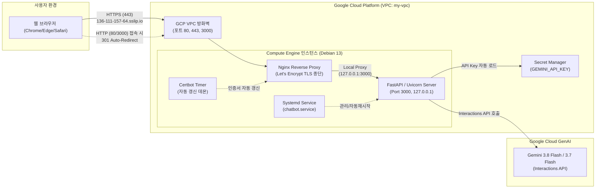

# Google Gemini 3.8 Flash & 3.7 Flash 웹 챗봇 (Compute Engine & HTTPS)

> 이 폴더는 기존 Compute Engine 구현입니다. 아래 명령은 저장소 루트에서
> `cd compute_engine`을 실행한 뒤 사용합니다. Cloud Run 버전은
> [cloud_run/README.md](../cloud_run/README.md)를 참고하세요.

Google Gemini 공식 웹 앱([gemini.google.com](https://gemini.google.com/app?hl=ko))의 모던한 디자인과 기능을 계승한 한국어 대화형 AI 웹 챗봇입니다.  
공식 `google-genai` Python SDK의 **Interactions API**를 활용하며, Google Cloud Platform (GCP) Compute Engine에 배포되어 **Let's Encrypt 공인 SSL/TLS 기반 HTTPS**로 안전하게 서비스됩니다.

---

## 🌐 서비스 접속 URL
- **공식 HTTPS 접속 주소**: 👉 **[https://136-111-157-64.sslip.io](https://136-111-157-64.sslip.io)**
- *(참고)* `http://136.111.157.64` 또는 `http://136.111.157.64:3000`으로 접속 시에도 보안 HTTPS 도메인으로 자동 리다이렉트(301 Moved Permanently)됩니다.

---

## 🔒 HTTP vs HTTPS 비교 및 프로토콜 전환 배경

초기 개발 단계에서는 빠른 프로토타입 확인을 위해 HTTP(포트 3000) 기반으로 인스턴스를 구동했습니다.  
그러나 실제 웹 브라우저(Chrome 등)에서 IP 기반 HTTP 접속 시 **"주의 요함(Not Secure)"** 보안 경고가 발생하며, 음성 인식(Web Speech API) 등 최신 보안 브라우저 API가 차단되는 제약이 발생하여 **공인 HTTPS 환경으로의 고도화**를 진행했습니다.

### 1. HTTP와 HTTPS의 핵심 차이점

| 비교 항목 | HTTP (HyperText Transfer Protocol) | HTTPS (HTTP Secure / TLS) |
| :--- | :--- | :--- |
| **보안 계층** | 암호화 없음 (애플리케이션 계층 직결) | **SSL / TLS 암호화 전송 계층** 적용 |
| **데이터 전송 형태** | **평문(Plaintext)** 전송 | **대칭키/비대칭키 혼합 암호화** 전송 |
| **보안 취약점** | 패킷 도청(Sniffing), 변조(Tampering), 중간자 공격(MITM)에 취약 | 도청 및 변조 원천 차단, 데이터 무결성 보장 |
| **서버 인증** | 서버의 진위 여부 검증 불가 (피싱 위험) | **공인 인증기관(CA)** 디지털 인증서로 서버 신원 증명 |
| **브라우저 표시** | 주소창에 **"주의 요함"** / 경고 아이콘 표시 | 주소창에 안전한 **보안 자물쇠 🔒** 표시 |
| **최신 Web API 지원** | Web Speech API, 마이크 접근, 클립보드 API 등 차단 | 모든 모던 HTML5/Web API 정상 권한 획득 가능 |
| **표준 포트** | 기본 포트 `80` (개발 환경 주로 `3000`, `8080`) | 기본 포트 `443` |

---

## 🛠️ HTTPS 구축을 위해 적용된 핵심 기술 및 아키텍처

Compute Engine의 공인 IP(`136.111.157.64`) 환경에서 브라우저 보안 경고 없이 100% 신뢰할 수 있는 HTTPS 환경을 구성하기 위해 다음 기술 스택들이 유기적으로 결합되었습니다.



### 1. 와일드카드 자동 라우팅 DNS (`sslip.io`)
- **도입 이유**: Let's Encrypt 등의 공인 인증기관(CA)은 일반적인 원시 IP 주소(`136.111.157.64`)에 대해 무료 SSL 인증서를 발급하지 않습니다. 별도의 유료 커스텀 도메인 구매 없이도 즉시 인증서를 발급받기 위해 DNS 기술을 활용했습니다.
- **적용 기술**: `sslip.io`는 호스트명에 포함된 IP 주소로 DNS A 레코드를 자동 응답하는 공공 DNS 매핑 서비스입니다.
  - `136-111-157-64.sslip.io` 질의 시 전 세계 DNS 서버가 `136.111.157.64`를 정확히 반환합니다.
  - 이를 통해 공인 CA가 요구하는 정규 FQDN(도메인) 요건을 완벽하게 충족했습니다.

### 2. Nginx 역방향 프록시 (Reverse Proxy) & SSL Termination
- **도입 이유**: 백엔드 Python 앱(FastAPI/Uvicorn)이 직접 SSL 핸드셰이크를 처리하면 성능 저하 및 인증서 관리 복잡도가 증가합니다. Nginx를 전면에 배치하여 보안과 트래픽 관리를 분리했습니다.
- **적용 기술**:
  - **SSL 종단(SSL Termination)**: 클라이언트와 Nginx 사이는 HTTPS(포트 443, TLS 1.2/1.3)로 고속 암호화 통신을 수행하고, Nginx와 FastAPI 간은 로컬 루프백(`127.0.0.1:3000`)으로 안전하게 중계합니다.
  - **HTTP → HTTPS 자동 리다이렉트**: 포트 80으로 들어오는 모든 일반 HTTP 요청을 `301 Moved Permanently` 상태 코드를 통해 즉시 HTTPS 보안 주소로 전환합니다.
  - **WebSocket / 스트리밍 최적화**: LLM 스트리밍 응답 처리를 위해 `proxy_buffering off`, `proxy_read_timeout 120s`, `Upgrade` 및 `Connection` 헤더 포워딩을 구성했습니다.

### 3. Let's Encrypt & Certbot (자동 ACME 인증서 발급/갱신)
- **적용 기술**:
  - 글로벌 비영리 공인 인증기관인 **Let's Encrypt**의 **ACME (Automated Certificate Management Environment)** 프로토콜을 사용했습니다.
  - `certbot` 및 `python3-certbot-nginx` 플러그인을 사용하여 HTTP-01 챌린지 검증을 자동으로 통과하고, 정식 서명된 TLS 인증서(`fullchain.pem`, `privkey.pem`)를 발급받아 Nginx에 자동 바인딩했습니다.
  - `certbot.timer` systemd 타이머 데몬이 활성화되어 90일 만료 주기 도래 전 백그라운드에서 인증서를 무중단 자동 갱신합니다.

### 4. GCP VPC 방화벽 (Firewall Rules) 구성
- **적용 기술**:
  - `allow-http-80`: ACME 인증서 발급 챌린지 및 HTTP 리다이렉트를 위해 포트 80 인바운드 허용
  - `allow-https-443`: 암호화된 안전한 웹 트래픽 서비스를 위해 포트 443 인바운드 허용
  - `allow-ssh-ingress-from-iap`: 인스턴스 관리용 SSH 접속을 Cloud IAP 대역(`35.235.240.0/20`)에 한해 안전하게 허용
  - 인스턴스 네트워크 태그에 `chatbot-server`, `http-server`, `https-server` 지정

### 5. Google Cloud Secret Manager & Compute Engine Metadata 연동
- **적용 기술**:
  - `GEMINI_API_KEY`를 소스 코드나 Git에 커밋하지 않고 GCP Secret Manager(`projects/902882112756/secrets/GEMINI_API_KEY`)에 안전하게 저장했습니다.
  - VM 인스턴스의 서비스 어카운트(`902882112756-compute@developer.gserviceaccount.com`)에 `roles/secretmanager.admin` 역할을 부여하여 배포 스크립트 및 런타임에서 API 키를 안전하게 자동 주입합니다.

---

## ✨ 챗봇 주요 기능 및 특징

1. **공식 `google-genai` Python SDK Interactions API 연동**:
   - `client.interactions.create(..., background=True, tools=tools)`와 비동기 폴링 루프 기반 실시간 처리
   - **Google Search**: 실시간 웹 검색 및 팩트 체크
   - **Code Execution**: 파이썬 코드 실행 및 수학/데이터 연산 검증
   - **URL Context**: 웹 문서 및 링크 컨텍스트 자동 추출
2. **Google Gemini 공식 웹 UI 완벽 구현**:
   - 부드러운 스카이블루 오로라 배경 (`radial-gradient`)
   - Gemini 공식 스파클 로고 및 플로팅 알약형(Pill-shaped) 입력 인터페이스
   - **사고 모델 전환 메뉴**: `Gemini 3.8 Flash`(기본), `Gemini 3.7 Flash`, `Antigravity Preview 에이전트` 실시간 전환 지원
   - 모델별 '사고 과정(Thinking)' 및 도구 사용 상태 뱃지 표시
3. **한국어 사용자 경험(UX) 최적화**:
   - 한글 IME 입력 중 Enter 키 중복 발송 방지 (`isComposing`, `keyCode: 229` 완벽 제어)
   - **Web Speech API 음성 인식**: 마이크(`🎙️`) 클릭 시 한국어 음성을 텍스트로 실시간 변환 (HTTPS 환경에서 정상 동작)
   - 마크다운 서식 지원 (코드 블록, 신택스 강조, 원클릭 복사 버튼 등)
   - 멀티턴(Multi-turn) 대화 문맥 유지 (`previous_interaction_id`)

---

## 📁 프로젝트 디렉터리 구조

```text
gcp-compute-engine-chatbot/compute_engine/
├── deploy/
│   ├── provision_and_deploy.py  # Compute Engine VM 인스턴스 검사/생성 및 자동 배포 파이프라인
│   ├── setup_vm.sh              # VM 내부 애플리케이션 초기화 (Python venv, Systemd 등록)
│   └── setup_https.sh           # Nginx 리버스 프록시 및 Let's Encrypt SSL 자동화 스크립트
├── public/                      # 프론트엔드 정적 리소스
│   ├── index.html               # Gemini 웹 UI 레이아웃 및 HTTPS 자동 전환 스크립트
│   ├── style.css                # Gemini 공식 테마 및 반응형 CSS 디자인
│   └── app.js                   # 챗봇 상태 관리, 모델 전환, 음성 인식, 마크다운 렌더링
├── compute_engine_example.ipynb # GCP Compute Engine 실습 및 리전별 가격 분석 노트북
├── server.py                    # FastAPI 기반 GenAI Interactions 백엔드 서버
├── requirements.txt             # Python 의존성 라이브러리 목록
├── deployment.log               # GCP 프로비저닝 및 배포 이력 로그
├── package.json                 # 보조 스크립트 메타데이터
└── README.md                    # 프로젝트 가이드 및 기술 문서
```

---

## 🚀 빠른 시작 가이드 (로컬 개발)

### 1. 환경변수 설정
시스템 환경변수에 `GEMINI_API_KEY`를 설정하거나 `compute_engine/.env` 파일을 생성합니다:
```bash
export GEMINI_API_KEY="your-gemini-api-key"
```

### 2. 의존성 설치 및 서버 실행
```bash
python3 -m venv venv
source venv/bin/activate
pip install -r requirements.txt

python3 server.py
```

### 3. 브라우저 접속
로컬 개발 환경 주소로 접속합니다:
👉 **[http://127.0.0.1:3000](http://127.0.0.1:3000)**

---

## 🔄 Compute Engine 재배포 및 HTTPS 재구성 방법

VM 인스턴스 환경을 새로 배포하거나 SSL 설정을 갱신할 때는 아래 명령어를 사용할 수 있습니다:

```bash
# 1. Compute Engine 인스턴스 확인/생성 및 소스코드 자동 배포
python3 deploy/provision_and_deploy.py

# 2. SSL/HTTPS 재구성 (VM 내부 또는 SSH 실행)
gcloud compute ssh instance-20260915-52079 \
    --zone=us-central1-c \
    --tunnel-through-iap \
    --command="chmod +x setup_https.sh && ./setup_https.sh"
```
